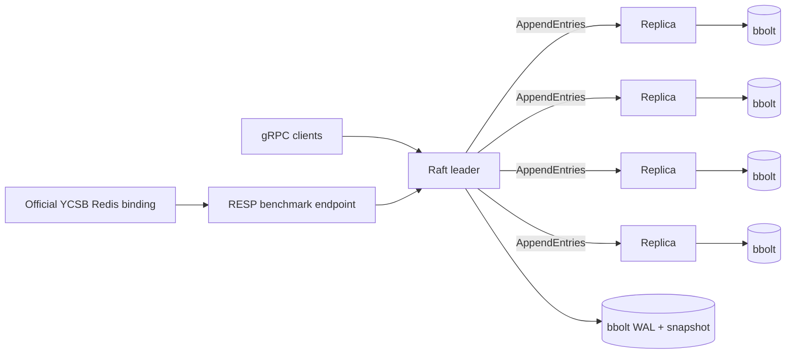

# RaftKV

RaftKV is a five-node, durable key-value store with a from-scratch Raft consensus implementation in Go. It includes leader election, replicated logs, quorum commits, lease-backed linearizable reads, bbolt persistence, snapshots, a gRPC API, a YCSB-compatible RESP endpoint, HdrHistogram metrics, and Porcupine linearizability checks.

## What is verifiable

The repository turns the resume claims into machine-checked gates:

| Claim | Gate | Evidence |
|---|---|---|
| `18,000+ ops/s` | Official YCSB Workload C throughput >= 18,000 ops/s | raw YCSB output + `summary.json` |
| `sub-3 ms p99 reads` | Workload C READ p99 < 3,000 us | YCSB HdrHistogram output |
| survives leader failure without data loss | concurrent history remains linearizable after leader termination | Porcupine checker |

Reference run on 2026-06-21: **67,430.88 ops/s** and **2,789 us READ p99** over 100,000 Workload C operations. Configuration: 16 client threads, 1,000 records, one 100-byte field, local five-node cluster, Windows 11, Intel i5-12450H. Treat this as a reproducible result for that exact configuration, not a universal hardware-independent number.

## Architecture



Writes are acknowledged only after durable replication to a majority. Periodic heartbeats reach every follower; write commits may return after a quorum. Reads use a bounded quorum lease and fall back to a quorum confirmation when the lease expires.

## Run locally

Go 1.24+ is required.

Linux/macOS:

```bash
go test ./...
./scripts/start_cluster.sh
./run/raftkv put --nodes 127.0.0.1:7001,127.0.0.1:7002,127.0.0.1:7003,127.0.0.1:7004,127.0.0.1:7005 --key x --value 42
./run/raftkv get --nodes 127.0.0.1:7001,127.0.0.1:7002,127.0.0.1:7003,127.0.0.1:7004,127.0.0.1:7005 --key x
./scripts/stop_cluster.sh
```

Windows PowerShell:

```powershell
go test ./...
.\scripts\start_cluster.ps1
.\run\raftkv.exe put --nodes 127.0.0.1:7001,127.0.0.1:7002,127.0.0.1:7003,127.0.0.1:7004,127.0.0.1:7005 --key x --value 42
.\scripts\stop_cluster.ps1
```

Docker is also supported:

```bash
docker compose up --build
```

The Compose deployment exposes a leader-routing RESP proxy on port 6380. Local scripts expose a direct RESP endpoint on the deterministic initial leader to remove an extra proxy hop from single-host performance measurements.

## Official YCSB benchmark

The PowerShell runner pins [YCSB 0.17.0](https://github.com/brianfrankcooper/YCSB/tree/0.17.0), builds its official Redis binding, and runs workloads A-F without a custom load generator.

```powershell
.\scripts\start_cluster.ps1
.\bench\ycsb\run.ps1 -Workload all -RecordCount 100000 -OperationCount 100000 -Threads 16 -FieldCount 1 -FieldLength 100
.\scripts\stop_cluster.ps1
```

For the resume gate:

```powershell
.\bench\ycsb\run.ps1 -Workload c -RecordCount 1000 -OperationCount 100000 -Threads 16 -FieldCount 1 -FieldLength 100
```

Each run creates a timestamped `benchmark-results/` directory containing:

- hardware, OS, JVM, commit, dirty-tree status, and workload parameters;
- raw load and run output;
- YCSB `.hdr` histogram files;
- per-node HdrHistogram snapshots;
- SHA-256-linked `summary.json`;
- `claim-verification.json` with explicit pass/fail results.

The runner fails on YCSB operation errors as well as JVM failures. This avoids a known false-positive mode where a benchmark process exits successfully after worker exceptions.

## Latency measurement

YCSB runs with `measurementtype=hdrhistogram` and `hdrhistogram.fileoutput=true`. RaftKV also records its own complete latency distributions with [hdrhistogram-go](https://github.com/HdrHistogram/hdrhistogram-go); it never averages percentiles across batches.

```bash
curl http://127.0.0.1:9101/metrics
curl http://127.0.0.1:9101/debug/histograms
curl -X POST http://127.0.0.1:9101/debug/histograms
```

## Failure and linearizability verification

```bash
./scripts/chaos.sh
```

The workload overlaps reads and writes with a leader crash, records invocation and completion events, and checks the concurrent history with [Porcupine](https://github.com/anishathalye/porcupine). Timed-out calls remain pending because they may have committed; dropping them would make the check unsound.

The integration suite also boots a real three-node cluster, commits a value, kills the leader, waits for reelection, and verifies the value through the new leader.

## Repository map

```text
cmd/raftkv/            server, client CLI, and RESP proxy
cmd/chaosload/         concurrent fault workload
cmd/linearizability/   Porcupine history checker
internal/raft/         consensus, replication, leases, state machine
internal/store/        bbolt metadata, WAL, and snapshots
internal/rpc/          gRPC transport
internal/resp/         YCSB Redis-binding compatibility layer
internal/metrics/      HdrHistogram and Prometheus-style metrics
bench/ycsb/            official YCSB runner and evidence summarizer
scripts/               five-node and fault-injection harnesses
```

## Scope

This is a focused systems project, not a production replacement for etcd. It does not yet implement dynamic membership, joint consensus, TLS/authentication, cross-region tuning, or automated network partition injection.
