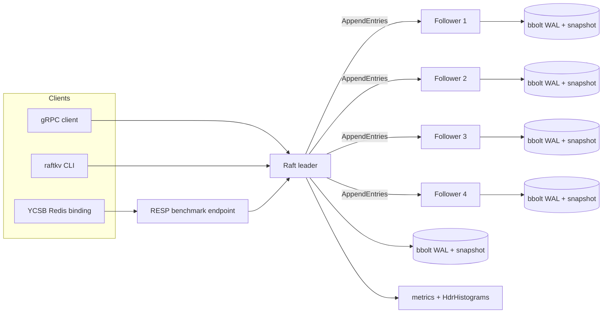

# RaftKV


RaftKV is a durable, five-node key-value store built around a from-scratch Raft implementation in Go. It includes leader election, replicated logs, quorum commits, lease-backed linearizable reads, bbolt-backed write-ahead persistence, snapshots, gRPC replication, a RESP endpoint for YCSB, HdrHistogram latency accounting, Prometheus-style metrics, and Porcupine-based linearizability checks.

The project is designed as a systems-engineering artifact: correctness, failure behavior, and performance claims are backed by retained benchmark output rather than ad-hoc scripts.

## Highlights

- Raft leader election, heartbeats, append entries, commit indexes, and state-machine application.
- Durable bbolt WAL/snapshot storage for node restart and follower catch-up.
- Lease-backed linearizable reads with quorum confirmation when the lease expires.
- gRPC transport for node-to-node replication and client writes.
- RESP-compatible benchmark endpoint for the official YCSB Redis binding.
- HdrHistogram-based latency reporting without percentile averaging.
- Prometheus-style metrics and debug histogram endpoints.
- Porcupine linearizability checks for fault-injection histories.
- Reproducible YCSB evidence directories with raw output, histogram files, node stats, manifest data, and pass/fail claim gates.

## Verified performance

Reference run: `benchmark-results/20260622T164348Z`

| Metric | Result |
|---|---:|
| Benchmark harness | YCSB 0.17.0 Redis binding |
| Workload | Workload C, read-only |
| Cluster | 5 local durable Raft nodes |
| Records | 1,000 |
| Operations | 100,000 |
| Client threads | 8 |
| Value size | 100 bytes |
| Throughput | 51,150.90 ops/sec |
| READ average latency | 144.36 us |
| READ p95 latency | 352 us |
| READ p99 latency | 1,627 us / 1.63 ms |
| Successful reads | 100,000 / 100,000 |

Claim gates retained in `claim-verification.json`:

| Gate | Result |
|---|---:|
| Workload C throughput >= 18,000 ops/sec | Passed |
| Workload C READ p99 < 3,000 us | Passed |

The reference result was measured on a local Windows 11 development profile with an Intel i5-12450H. Treat the number as evidence for that disclosed setup, not as a hardware-independent production SLA.

## Architecture



Write path:

1. A client routes the mutation to the leader.
2. The leader appends to its local WAL.
3. Replication is sent to followers through gRPC.
4. The write is committed after durable majority acknowledgement.
5. The state machine applies the committed entry and the client receives success.

Read path:

1. The leader serves reads while a valid bounded quorum lease is active.
2. If the lease is expired, the leader performs a quorum confirmation before serving the read.
3. Latencies are recorded into HdrHistogram distributions exposed through debug endpoints and YCSB output.

## Quickstart

Requirements:

- Go 1.24 or newer
- PowerShell on Windows, or Bash on Linux/macOS
- Docker, only if using Compose

Windows:

```powershell
go test ./...
.\scripts\start_cluster.ps1
.\run\raftkv.exe put --nodes 127.0.0.1:7001,127.0.0.1:7002,127.0.0.1:7003,127.0.0.1:7004,127.0.0.1:7005 --key order:1 --value paid
.\run\raftkv.exe get --nodes 127.0.0.1:7001,127.0.0.1:7002,127.0.0.1:7003,127.0.0.1:7004,127.0.0.1:7005 --key order:1
.\scripts\stop_cluster.ps1
```

Linux/macOS:

```bash
go test ./...
./scripts/start_cluster.sh
./run/raftkv put --nodes 127.0.0.1:7001,127.0.0.1:7002,127.0.0.1:7003,127.0.0.1:7004,127.0.0.1:7005 --key order:1 --value paid
./run/raftkv get --nodes 127.0.0.1:7001,127.0.0.1:7002,127.0.0.1:7003,127.0.0.1:7004,127.0.0.1:7005 --key order:1
./scripts/stop_cluster.sh
```

Docker Compose:

```bash
docker compose up --build
```

Compose starts a five-node cluster and exposes a leader-routing RESP proxy on port `6380`.

## Benchmarking with YCSB

The benchmark runner uses the official YCSB 0.17.0 Redis binding. It does not use a custom workload generator.

Resume gate profile:

```powershell
.\scripts\start_cluster.ps1
.\bench\ycsb\run.ps1 -Workload c -RecordCount 1000 -OperationCount 100000 -Threads 8 -FieldCount 1 -FieldLength 100
.\scripts\stop_cluster.ps1
```

Full workload pass:

```powershell
.\bench\ycsb\run.ps1 -Workload all -RecordCount 100000 -OperationCount 100000 -Threads 16 -FieldCount 1 -FieldLength 100
```

Concurrency sweep:

```powershell
.\bench\ycsb\sweep.ps1 -ThreadCounts 1,2,4,8,16,32
```

Each run writes a timestamped `benchmark-results/` directory containing:

- raw YCSB load and run output;
- YCSB HdrHistogram files;
- per-node histogram and status snapshots;
- environment and workload manifest;
- SHA-256-linked `summary.json`;
- `claim-verification.json` with explicit pass/fail gates.

## Observability

```bash
curl http://127.0.0.1:9101/metrics
curl http://127.0.0.1:9101/debug/histograms
curl -X POST http://127.0.0.1:9101/debug/histograms
```

The metrics surface includes Raft role/state gauges, request counters, and latency histograms. Histogram snapshots are useful for validating p95/p99 behavior outside the YCSB JVM.

## Correctness and fault testing

```bash
./scripts/chaos.sh
```

The chaos workload overlaps reads and writes with a leader crash, records invocation/completion histories, and verifies the resulting execution with Porcupine. Timed-out operations remain pending because they may have committed; removing them would make the check unsound.

The integration suite also covers:

- deterministic quorum-loss rejection;
- stopped follower snapshot catch-up;
- leader failover with committed-value preservation;
- metrics registry behavior;
- WAL and snapshot persistence.

## Repository layout

```text
cmd/raftkv/            server process, CLI client, and RESP proxy
cmd/chaosload/         concurrent fault workload
cmd/linearizability/   Porcupine history checker
internal/raft/         consensus, replication, leases, and state machine
internal/store/        bbolt metadata, WAL, and snapshots
internal/rpc/          gRPC transport
internal/resp/         YCSB Redis-binding compatibility layer
internal/metrics/      HdrHistogram and Prometheus-style metrics
bench/ycsb/            official YCSB runner and evidence summarizer
scripts/               local cluster and fault-injection harnesses
```

## Scope

RaftKV is a focused consensus and storage project. It intentionally does not yet include dynamic membership, joint consensus, TLS, authentication, cross-region tuning, or automated network partition injection. The verified claims are limited to the disclosed local benchmark and retained evidence files.
