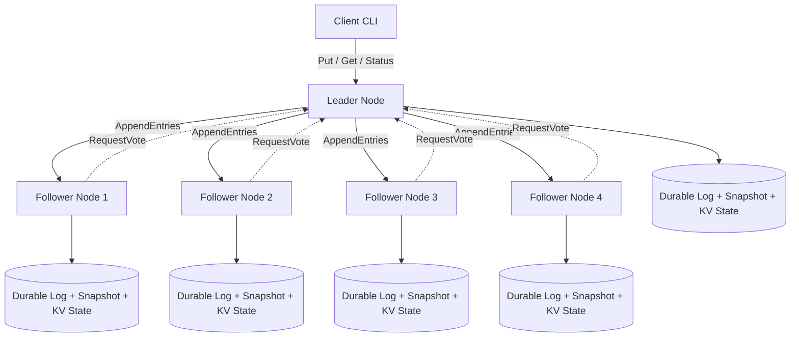

# RaftKV

RaftKV is a fault-tolerant replicated key-value store built in Go with a custom Raft consensus engine. It implements leader election, log replication, majority-quorum commits, durable state, snapshot-based log compaction, and local fault-injection testing across a 5-node cluster.

The project is designed to demonstrate the core mechanics behind replicated storage and coordination systems in a compact, developer-friendly codebase.

---

## Features

- Custom Raft consensus implementation in Go
- Leader election with randomized election timeouts
- Log replication via `AppendEntries`
- Majority-quorum write commits
- Leader-routed reads and writes
- Durable Raft metadata and replicated log storage
- Snapshot-based log compaction
- 5-node local cluster harness
- Fault-injection workflow for leader failure
- History checker for stale-read detection
- Docker Compose-based local deployment
- GitHub Actions CI workflow

---

## Architecture



Each client write is routed to the current leader. The leader appends the command to its local log, replicates it to follower nodes, and marks the entry committed only after receiving acknowledgements from a majority of the cluster. Committed entries are then applied to the key-value state machine in log order.

---

## Tech Stack

| Area | Technology |
|------|------------|
| Language | Go |
| Consensus | Custom Raft implementation |
| Storage | Durable metadata, replicated log, snapshots |
| Transport | RPC-based node and client communication |
| Validation | Go tests, fault scripts, history checker |
| Local Orchestration | Bash scripts, Docker Compose |
| CI/CD | GitHub Actions |
| Verification Tooling | Python history checker |

---

## Getting Started

### 1. Run tests

```bash
go test ./...
```

### 2. Start a 5-node cluster

```bash
./scripts/start_cluster.sh
```

This script builds the RaftKV binary, starts five local nodes, waits for leader election, and prints cluster status after the cluster is ready.

### 3. Run the demo workflow

```bash
./scripts/demo.sh
```

The demo performs:

- cluster status check
- write operation
- read operation
- multiple writes to trigger snapshotting
- final replicated state verification

### 4. Stop the cluster

```bash
./scripts/stop_cluster.sh
```

---

## CLI Usage

Set the node list:

```bash
NODES="127.0.0.1:7001,127.0.0.1:7002,127.0.0.1:7003,127.0.0.1:7004,127.0.0.1:7005"
```

### Cluster status

```bash
./run/raftkv status --nodes "$NODES"
```

### Write a key

```bash
./run/raftkv put --nodes "$NODES" --key user:1 --value active
```

### Read a key

```bash
./run/raftkv get --nodes "$NODES" --key user:1
```

---

## Fault Injection and Verification

RaftKV includes a local chaos workflow that starts a 5-node cluster, writes data, kills the active leader, continues operations through the remaining quorum, and validates the observed history.

```bash
./scripts/chaos.sh
```

Sample result:

```text
killing leader n5
PASS: checked 9 events; no stale reads after successful writes
cluster stopped
```

The history checker verifies that successful reads do not observe stale values after successful writes in the recorded execution order.

---

## Snapshotting and Log Compaction

RaftKV supports snapshot-based log compaction after a configurable commit threshold. Once the threshold is reached, the node persists a compacted snapshot of the current key-value state and truncates older log entries.

Example output from the demo:

```text
snapshot_index: 30
```

This prevents unbounded log growth during sustained workloads.

---

## Benchmarking

Run a local benchmark:

```bash
./scripts/start_cluster.sh

NODES="127.0.0.1:7001,127.0.0.1:7002,127.0.0.1:7003,127.0.0.1:7004,127.0.0.1:7005"
./run/raftkv bench --nodes "$NODES" --n 50

./scripts/stop_cluster.sh
```

Sample local result on WSL:

```text
writes=50 throughput=34.5_ops/sec p50=29.875ms p99=51.356ms
```

Benchmark results depend on hardware, operating system, filesystem, and background workload.

---

## Docker Compose

Start the cluster with Docker Compose:

```bash
docker compose up --build
```

In another terminal:

```bash
go build -o run/raftkv ./cmd/raftkv

NODES="127.0.0.1:7001,127.0.0.1:7002,127.0.0.1:7003,127.0.0.1:7004,127.0.0.1:7005"

./run/raftkv put --nodes "$NODES" --key x --value 42
./run/raftkv get --nodes "$NODES" --key x
```

---

## Reliability Checks

RaftKV validates correctness through:

- unit tests for consensus and storage components
- 5-node cluster startup verification
- leader election checks
- quorum write validation
- leader crash workflow
- stale-read history checking
- CI smoke tests for failure scenarios

---

## Repository Structure

```text
cmd/raftkv/          CLI and server entry point
internal/raft/       Raft consensus implementation
internal/rpc/        RPC transport and request handling
internal/store/      durable metadata, log, and snapshot storage
scripts/             cluster startup, demo, chaos, and benchmark scripts
tools/               history checker utilities
docs/                design and benchmark notes
.github/workflows/   CI configuration
```

---

## Current Scope

RaftKV focuses on the core mechanics of consensus and replication. It currently does not include:

- dynamic cluster membership changes
- proxy-based network partition simulation
- lease reads or ReadIndex optimization
- advanced compaction tuning
- full formal linearizability verification
- production deployment hardening

---

## Roadmap

- Add proxy-based network partition testing
- Add stronger linearizability verification
- Add read-index based linearizable reads
- Improve benchmark throughput through batching
- Add metrics endpoint for cluster health
- Add lightweight dashboard for node status and replication state

---

## License

MIT License
